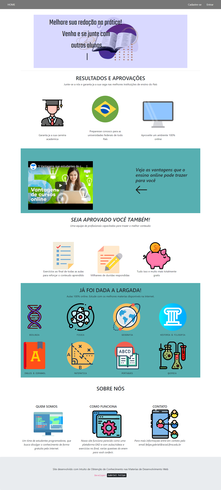
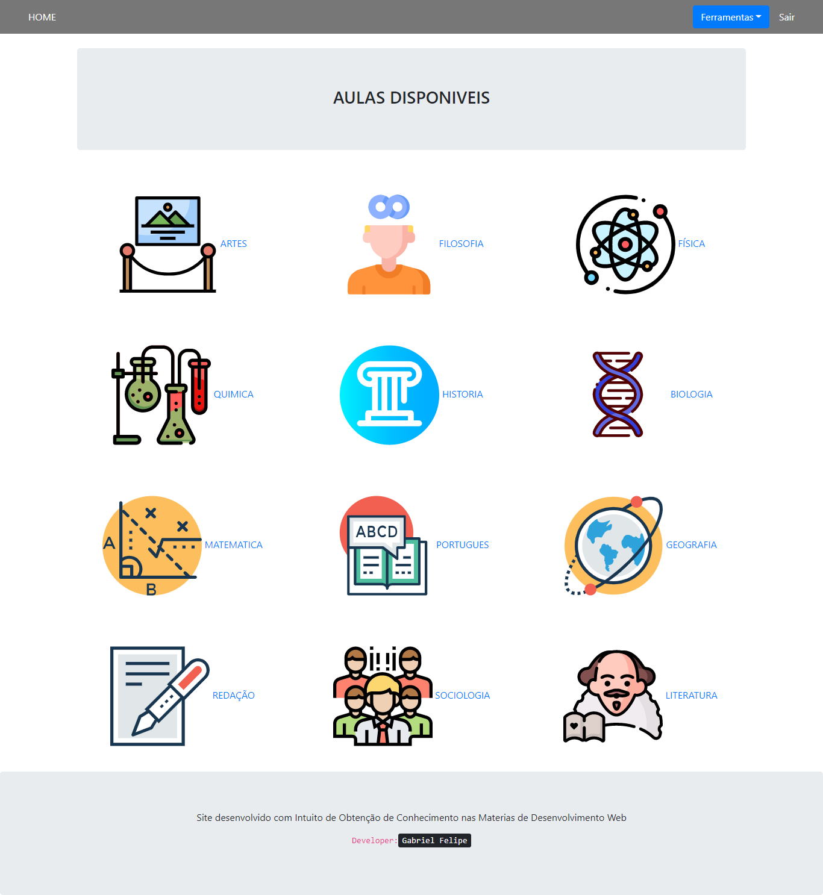
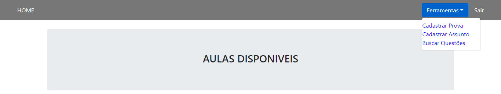
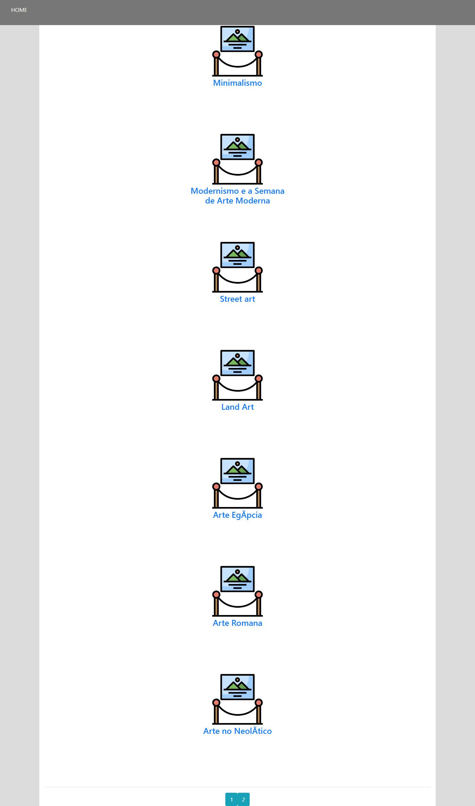
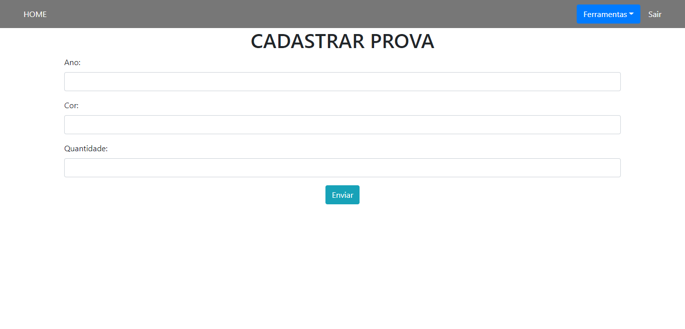

# Projeto Enem
## Projeto desenvolvido em 2019_

O projeto foi desenvolvido com o intuito de ser um site de estudo
para o enem.

## Sobre

Em 2019, com a formatura dos alunos do Instituto Federal estava se aproximando, foi proposto que nosso tcc fosse desenvolvido com a temática de um site sobre aulas e atividades para estudantes que queriam treinar para o enem.

O projeto teve seu ínicio aproximadamente em Setembro de 2019 e sua finalização em dezembro de 2019.

> O projeto não foi alterado desde sua fialização em 2019.
> Optei por não alteralo, pois gostaria de demonstrar a minha evolução 
> na programação com php com projetos mais recentes com essa linguagem.

## Tecnologias
- Html 
- Css
- Bootstrap 
- Jquery
- Git
- Php
- Mysql

## Screenshots do projeto

### Pagina Inicial (não logado)

   

### Pagina Inicial (logado)

   

### Menu 

   

### Aulas

   

### Cadastro de Provas

   

### Cadastro de Assunto

   
